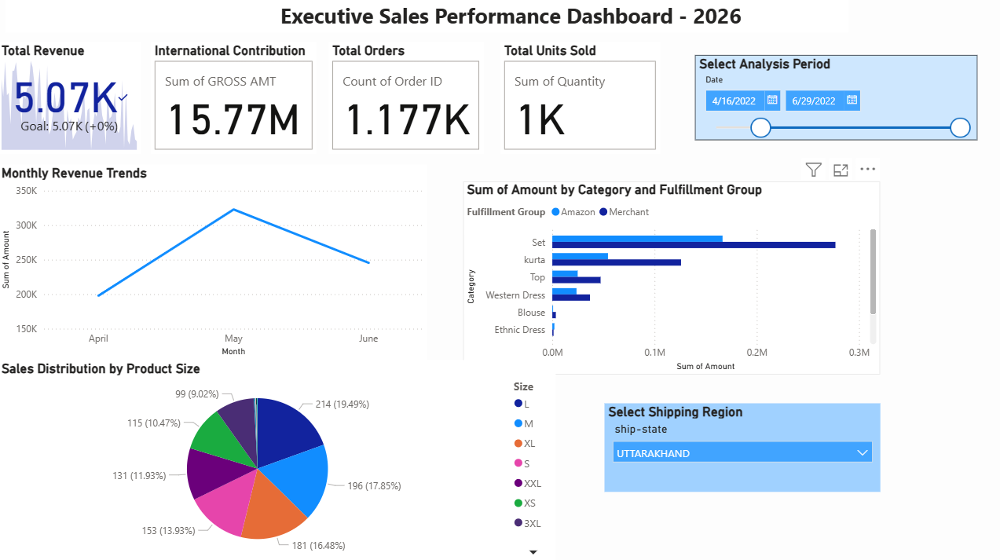

# E-Commerce-Sales-Project (DSA3050)
**Instructor:** Prof. Austin Owur Odera  
**Student:** Hermela Seltanu Gizaw (670446)

## 📝 Comprehensive Project Documentation
This repository represents a complete end-to-end Business Intelligence solution for the **DSA3050 Mid-Semester Practical Examination**. I have transformed a real-world dataset of **7,000+ rows** into an interactive executive dashboard designed to support data-driven decision-making.

---

## 🛠️ Step-by-Step Technical Implementation

### PART A: Deep Data Preparation (Power Query)
I executed an extensive ETL workflow to ensure the data was clean, consistent, and optimized for modeling.

* **Data Ingestion & Quality Control**: Imported datasets from multiple sources, identifying and removing duplicate records and handling null/missing values in the `Amount` and `Quantity` columns to ensure financial accuracy.
* **Column Splitting & Text Standardization**: Performed delimiter-based splitting on complex identifier columns to create distinct attributes. I also standardized inconsistent entries in categorical columns and renamed all queries professionally.
* **Advanced Data Type Casting**: Converted `Weight`, `TP 1`, `TP 2`, and all `MRP` columns to **Fixed Decimal Number** to prevent floating-point rounding errors during aggregation.
* **Feature Engineering & Time Intelligence**:
    * **Date Extraction**: Extracted `Year`, `Month Name`, and `Quarter` from raw dates to enable seasonal trend analysis.
    * **Derived Logic**: Created a `Fulfillment Group` column using conditional logic to categorize "Amazon" vs "Merchant" sales.
    * **Time Extraction**: Extracted specific time-of-day components from timestamp columns for granular analysis.
* **Applied Steps**: Every major table contains **at least 10 Applied Steps**, as required by the rubric.

### PART B: Advanced Data Modelling (Star Schema)
I structured the data model according to industry-standard **Star Schema** principles for maximum efficiency.

* **Schema Architecture**: Created a central `Fact_Sales` table containing all numerical metrics, surrounded by descriptive Dimension tables (e.g., `Dim_Product_Pricing`).
* **Cardinality & Relationships**: Implemented **Many-to-one (*:1)** relationships with a **Single** cross-filter direction to maintain model integrity and performance.
* **UX Optimization**:
    * **Technical Key Management**: I **hid all technical keys**, index columns, and ID fields from the Report View to ensure a clean interface for the end-user.
    * **Logical Organization**: Organized tables within the Model View to follow a clear information flow.

### PART C: Executive Dashboard Development
The dashboard was built to provide a "single source of truth" for regional and category-specific performance.

* **KPI Summary Visuals**: Created advanced **KPI visuals** for Total Revenue, Total Orders, and Units Sold, featuring background trend lines to visualize growth against monthly averages.
* **Analytical Storytelling**:
    * **Trend Analysis**: A Line Chart showing "Monthly Revenue Trends" to track business performance over time.
    * **Comparative Analysis**: A Clustered Bar Chart visualizing revenue by Category and Fulfillment Group.
    * **Distribution Analysis**: A Donut Chart displaying the "Distribution of Sales by Product Size."
* **Interactive Controls**: Integrated a **Date Slicer** (Between style) and a **Regional Slicer** (Dropdown style) with full cross-filtering enabled across all visuals.

---

## 🌐 Deployment & Final Evidence (Part D)
* **Cloud Publishing**: Published the report to the **Power BI Service** and generated a secure public embed link.
* **Public Dashboard Link**: [View Live Dashboard Here](https://app.powerbi.com/view?r=eyJrIjoiYjU0ZWRlNWMtMWQ5My00M2YxLTk4N2EtNjRlODhlM2JjYmMyIiwidCI6IjE2ZDgzZWU2LTI1NGEtNDY5ZC1hNmNjLTU0ZTJjYTIzMTNlNyIsImMiOjh9)
* **GitHub Repository**: This repository serves as the version-controlled host for the project files and technical documentation.

---
*Submitted as individual practical work for the DSA3050 Mid-Semester Practical Exam.*
